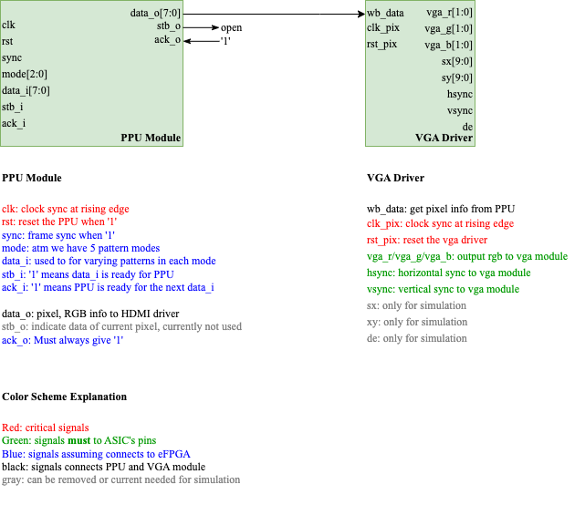

# FPGAIgnite-VGA
VGA team of the FPGA Ignite Hackathon

## Continuing Work on the Project
1. The most promising design can currently be found in the `verilator_sims` folder.
2. The design consists of two modules: the VGA driver and the PPU. One is located in `ppu.v` and the other in `vga_driver.sv`. The pinout and necessary signal connections are documented in the image below:
   

- For fabrication, please delete the signals marked in gray.
- When discussing with the FPGA team, the signals marked in blue are particularly important.
- It’s uncertain whether we should keep the two-module structure or merge them into a single module (this may be an optimization consideration).

3. We also include a `top.vhd` file that can be used to test the design on a real FPGA. This is targeted at the `Basys 3 board (?)`.
- To create a Vivado project, you can in Vivado, source the `project_1.tcl` file. This will create a project with the necessary files and constraints.
- We have made pre-built bitstreams available in the `bitstreams` folder. These can be used to test the design on the Basys 3 board. 