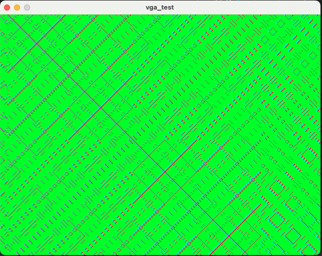

# Simulation of the VGA driver and PPU with Verilator so we are free from hardware constraints.


This folder contains Verilator simulations for debug our VGA driver.

[Verilator](https://www.veripool.org/verilator/) creates C++ simulations of Verilog designs, while [SDL](https://www.libsdl.org) produces simple cross-platform graphics applications. By combining the two, you can simulate a hardware design on your PC: no dev board required! Verilator is fast, but it's still much slower than an FPGA. However, for these simple designs, you can reach 60 FPS on a modern PC.


## Tested Versions

These simulations have been tested with:

* Verilator 4.038 (Ubuntu 22.04 amd64)
* Verilator 5.006 (macOS 13 arm64)
* Verilator 5.026 (macOS 14.1 x86_64)

## Build & Run

If this is the first time you've used Verilator and SDL, you need to [install dependencies](#installing-dependencies).

Make sure you're in the sim directory `verilator_sims`.

build all simulations:

```shell
make all
```

Run the simulation executables from `obj_dir`:

```shell
./obj_dir/vga_test
```
You will see a window with some colored squares like this:

and by change `ppu_mode` in top_vga_test.sv you can see different patterns.
You can quit the simulation by pressing the **Q** key.


_Note: all these designs use [simple_480p.sv](../simple_480p.sv) from the main [FPGA Graphics](../) folder._


## Acknowledgements
- The setup of the simulation is 100% based on the work of [Will Green](https://projectf.io/posts/verilog-sim-verilator-sdl/#verilator--sdl) and his [repo](https://github.com/projf/projf-explore/tree/main/graphics/fpga-graphics/sim)